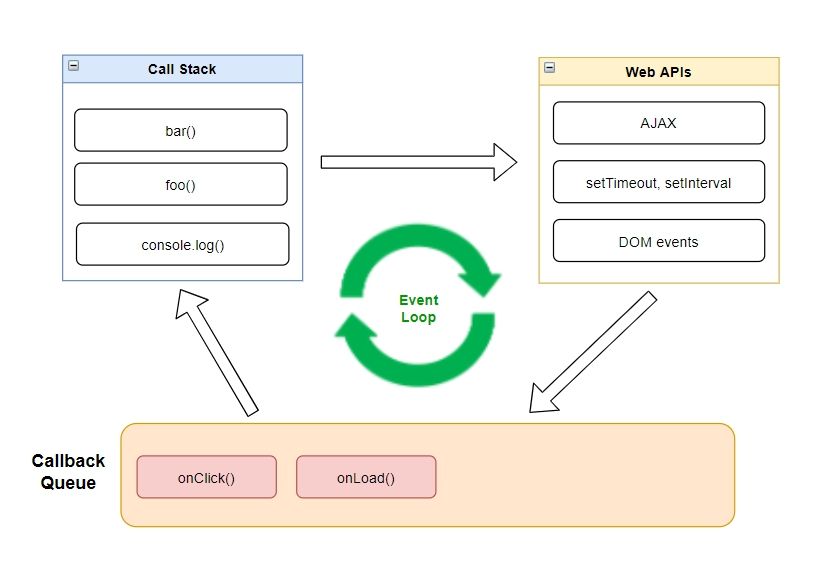
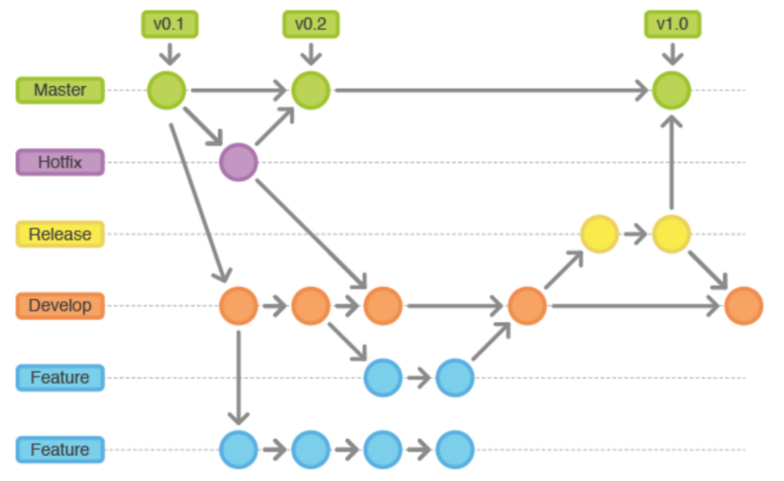
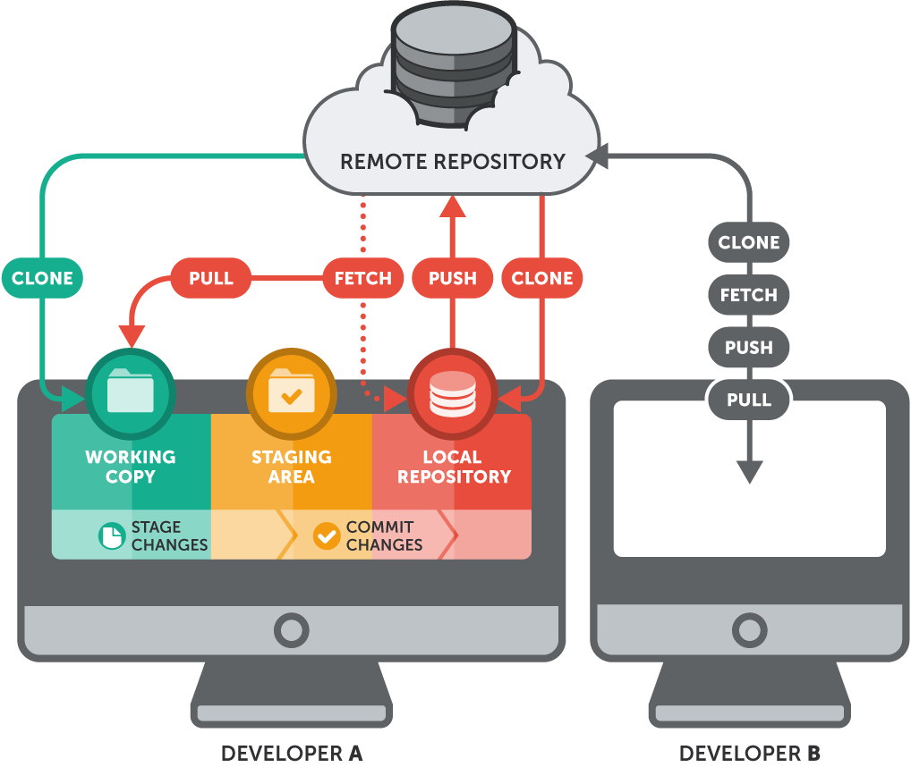
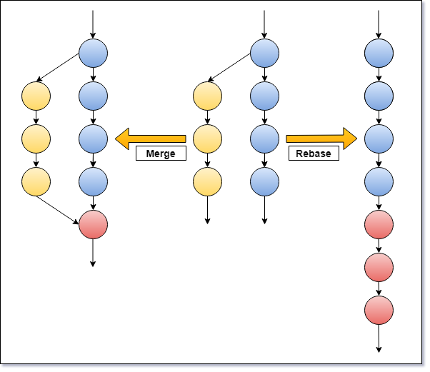

# Review Js_Git

Name: Lê Ngọc Vĩ
Team: Front-End
Onboarding: 04/04/2022

        JavaSCript Co ban

1. data type : String, Number, Boolean, null, undefined, BigInt và Symbol,Object, Array
2. break: thoát vòng lặp, continue: bỏ qua vòng lặp hiện tại -> next
3. vòng lặp: do while, while, for, forEach..
4. khai báo biến: var, let, const a=1;
5. toán tử và so sánh: +-*/ , == === != !== < > <= >= ++ -- 
6. localStorage: database trên web, trình duyệt, sessionStorage: giống localStorage mất khi ta đóng tab và trình duyệt, cookie(key,value): 
cookie có thể gửi request , cookie vẫn còn khi đóng tab chỉ mất khi set expires NA
7. sử dụng var, let, const: var -> function, let và const -> {}
8. DOM : mô hình đối tượng trong html -> thông qua DOM thì ta có thể truy xuất đến các thẻ HTML
=> Nhiệm vụ DOM:
	+ Cho phép truy xuất đến các thẻ html.
	+ Thay đổi các thuộc tính của thẻ html
	+ Thay đổi css của các thẻ html
	+ Tạo, xóa, thêm các thẻ html

9. Loop:
	+ for in: dùng để duyệt object => số lượng vòng lặ sẽ tương ứng với thuộc tính của object
		ví dụ: 
					var obj = {a: 1, b: 2, c: 3};    
					for (var key in obj) {
						console.log('obj.'+key+'='+obj[key]);
					};

	+ for of: duyệt array, string map....
		ví du: 
					var str= 'paul';
					for (var value of str) {
					console.log(value);
					}
	+ for each: lặp lại từng phần tử trong mảng theo thứ tự index
		ví dụ: arrayName.forEach(function(currentValue, index, array){
								function body
						})
		- Hàm được truyền vào forEach sẽ nhận tối đa 3 đối số đầu vào: không bắt buộc, chỉ truyền đối số cần thiết
				currentValue: Giá trị đang được vòng lặp xử lý
				index: Chí số của giá trị (currentValue) trong mảng
				array: toàn bộ array đang gọi đến forEach

Toán Tử Đặc Biệt

- ||: ví dụ: const a = b||5 (nếu b false thì giá trị a nhận là 5) b= '' hoặc 0,null,undefined
- ??: ví dụ : const a = b ?? 3 nếu b được định nghĩa thì trả về b còn ko thì vế sau ( b = null hoặc undefined thì trả về vế sau)
	+ ví dụ : a??=56 nếu a được định nghĩa thì bằng a còn ko thì bằng 56

======================================================

Event Loop : 
Web APIs: bản chất Runtime của Javascript chỉ có 1 luồng và không thể chạy multi-thread, vì thế browser đã viết thêm một Web APIs để bọc runtime này lại (tương tự dưới NodeJS sẽ dùng C++ để bọc V8 lại). Web APIs này sẽ giúp cho JS có thể hoạt động một cách bất đồng bộ như multi-thread.
Callback Queue: Như tên của nó là hàng đợi các callback do thằng Web APIs ở trên trả về.

	Xử lí bất đồng bộ trong javascript
Promise:
var promiseTest = new Promise ( function(resolve, reject) {
     
     if (true) {
           resolve(value1); //value trả về khi ok
     } else {
           reject(value2) ; //value trả ra khi fail
     }
});

  promiseTest
    .then(function(v1){ console.log(v1)})
    .catch(function(err){ alert(err)})

+các trạng thái promise: Pending (đang xử lý), Resolve(đã hoàn thành), Rejected (đã bị từ chối)

Callback : => 
function myDisplayer(something) {
  console.log(something)
}

function myCalculator(num1, num2, myCallback) {
  let sum = num1 + num2;
  myCallback(sum);
}

myCalculator(5, 5, myDisplayer);

async await : const test = async()=>{
	await getDataAPI();
	await fetchData(); => chạy theo trình tự 
}

		JAVASCRIPT NÂNG CAO

1. IIFE function: tự động gọi function
	+ cú pháp: (function nameorNot(mess){console.log(mess)})("HelloWord)
	+ lưu ý: dùng dấu ; trước IIFE, IIFE là hàm private(tạo ra nhưng ko chủ động gọi bên ngoài (sủ dụng đệ quy để gọi lại function))
	+ tạo : dùng function, arrow function

2. Scope: phạm vi trong JavaScript
	+ Global scope: có phạm vị hoạt động ở bất kỳ trong mã javascript của bạn.
	+ Function scope: có phạm vi hoạt động trong function mà bạn khai báo biến đó.
	+ Block scope: có phạm vị trong cặp dấu {} mà bạn khai báo biến đó. (ES6)
	
3. Closure: tính bao đóng của function 
	+ hàm con nằm trong hàm cha: truy cập được biến bên ngoài hàm cha, toàn cục, local
	+ được return về trong hàm cha: và function này nhớ được nơi mà nó được tạo (mỗi lần được tạo thì nó sẽ tạo ra phạm vi mới và nơi lưu trữ mới của nó)

4. Hoisting : 
	+ Hoisting với var,function : sẽ đưa khai báo biến var test lên trên và giá trị mặc định là undefined thực thi các câu lệnh tiếp theo( phần khai báo sẽ được đưa lên đầu )
	+ Hoisting với let,const : vẫn hoisted nhưng giá trị mặc định khi hoisted không tồn tại nên được biế được đưa vào vùng không truy cập được
		ví dụ: console.log(name);
			var name ;
			name = "kỳ" => thì trình biên dịch sẽ chạy và đẩy "var name" lên đầu

5. use trict hay Strict mode: chế độ nghiêm ngặt code trong JavaScript
	+ Ví dụ: fullName= "Le Quang Kỳ" => console.log(fullName) => Không xuất hiện lỗi
	+ Công dụng: tránh quên từ khóa khai báo, tránh trùng tên biến, sử dụng bộ nhớ hiệu quả tránh biến toàn cục
	+ Sủ dụng: thêm "use strict" vào đầu js => nếu không thì ko dùng được	

6. Primitive Types & Reference Types trong Javascript
	+ Primitive Type: String, Number, Boolean, null, undefined, BigInt và Symbol
	+ Reference Type: Object, Array, Function (kiểu tham chiếu -> nhớ đến con trỏ trong C)

7. Từ khóa this: trỏ đến đối tượng mà nó đang tham chiếu
	+ Trong một phương thức đối tượng, this đề cập đến đối tượng
	+ Đề cập đến biến toàn cục
	+ Trong phương thức() : ví dụ fullName : function() {return this.firstName + " " + this.lastName;}
	+ Lưu ý: khi dùng "use strict" => this is undefined

8. Function bind : cho phép ta ràng buộc đến đối tượng đó
	+ trả về 1 hàm mới
	Ví Dụ: 	const person={
			firstName:'A',
			lastName:'B',
			getFullName:function(){ this.firstName+this.lastName}
			}
			
		const personTest={
			firstName:'C',
			lastName:'D',
			}

		const getFullNamePersonTest = person.getFullName.bind(personTest);
		console.log(getFullNamePersonTest()) // CD

* So sánh bind , call , apply
+ CALL: gọi hàm, truyền object và đối số ,x
	- var person1 = {firstName: 'Jon', lastName: 'Kuperman'};
	- var person2 = {firstName: 'Kelly', lastName: 'King'};

function say(greeting1, greeting2) {
 console.log(greeting1 + ',' + greeting2 + ' ' + this.firstName + ' ' + this.lastName);
}

+ say.call(person1, 'Hello', 'Good morning'); // => Hello,Good morning Jon Kuperman
+ say.call(person2, 'Hello', 'Good morning'); // => Hello,Good morning Kelly King

+ APPLY: gọi hàm và truyền vào object và đối số array
	- var person1 = {firstName: 'Jon', lastName: 'Kuperman'};
	- var person2 = {firstName: 'Kelly', lastName: 'King'};

function say(greeting0, greeting1) {
 console.log(greeting0 + ',' + greeting1 + ' ' + this.firstName + ' ' + this.lastName);
}

+ say.apply(person1, ['Hello', 'Good moring']); // => Hello,Good moring Jon Kuperman
+ say.apply(person2, ['Hello', 'Good moring']); // => Hello,Good moring Kelly King

+ Bind: tạo hàm mới , đối số cách nhau ,
	- var person1 = {firstName: 'Jon', lastName: 'Kuperman'};
	- var person2 = {firstName: 'Kelly', lastName: 'King'};

function say(greeting0, greeting1) {
 console.log(greeting0 + ',' + greeting1 + ' ' + this.firstName + ' ' + this.lastName);
}

	- var sayHelloJon = say.bind(person1, 'Hello', 'Good morning');
	- var sayHelloKelly = say.bind(person2, 'Hello', 'Good morning');

	+ sayHelloJon(); // => Hello,Good morning Jon Kuperman
	+ sayHelloKelly(); // => Hello,Good morning Kelly King

* Các phương thức của Array trong JavaScript

1. Concat(): để nối mảng => trả về mảng mới

var array1 = ['a', 'b', 'c'];
var array2 = ['d', 'e', 'f'];
var array3 = array1.concat(array2);

console.log(array3); // > Array ["a", "b", "c", "d", "e", "f"]
console.log(array1); // > Array ["a", "b", "c"]
console.log(array2); // > Array ["d", "e", "f"]
-----------------------------------------------------------------------------------
2. fillter(): lọc mảng thỏa mãn điều kiện => mảng mới và không làm thay đổi mảng ban đầu
 var newArray = oldArray.fillter((item)=> ( item.name != "ky")) => lọc mảng và trả về mảng mới thỏa mãn điều kiện name!="ky"
-----------------------------------------------------------------------------------
3. find(): lọc và trả về phần tử đầu tiên nếu tìm thấy, nếu ko thì undefined => không làm thay đổi mảng
var array = [5, 12, 8, 130, 44];
var found = array.find((element)=> (element > 10));

console.log(found); // > 12
console.log(array); // > Array [5, 12, 8, 130, 44]
----------------------------------------------------------------------------------
4. forEach(): duyệt mảng
var array = ['a', 'b', 'c'];
array.forEach((element) =>(
  console.log(element);
)); 
console.log(array); // > Array ["a", "b", "c"]
---------------------------------------------------------------------------------
5. map(): tạo ra mảng mới, duyệt mảng và không làm thay đổi giá trị mảng
var array = [1, 4, 9, 16];

var map = array.map((item) =>(
  item * item
));

console.log(map);   // > Array [1, 16, 81, 256]
console.log(array); // > Array [1, 4, 9, 16]
------------------------------------------------------------------------
6. reduce(): trả về 1 giá trị duy nhất

Ví dụ để so sánh:
* không dùng reduce:
const value = 0;
const numbers = [10, 20, 30];
for (let i = 0; i < numbers.length; i++) {
    value += numbers[i];
}

* dùng reduce
const numbers = [5, 10, 15];
const total = numbers.reduce((accumulator, item) => accumulator + item) => chúng ta không truyền giá trị ban đầu vào thì mặc định sẽ là phần tử đầu tiên của mảng
//Result total = 60

=> Không cần khai báo thêm biến

***** Cú pháp :
arr.reduce(callback( accumulator, currentValue[, index[, array]] ) {
  // return result from executing something for accumulator or currentValue
}[, initialValue])

callback là hàm thực thi với từng phần tử của hàm, với 4 tham số là: accumulator, currentValue, index và array.

accumulator biến tích lũy, được trả về sau mỗi lần gọi hàm callback. =>gia tri tra ve khi ket thuc
currentValue phần tử của mảng đang được xử lý.
index (Optional) chỉ số của phần tử trong mảng đang được xử lý.
array (Optional) mảng hiện tại gọi hàm reduce().
initialValue là giá trị cho tham số thứ nhất (accumulator) của hàm callback trong lần gọi hàm đầu tiên. Nếu giá trị này không được cung cấp thì giá trị phần tử đầu tiên của mảng sẽ được sử dụng.

8. include(): tìm phần tử có trong mảng => true false  => arr.include(item)
9. some(): check xem all có vượt qua điều kiện hay không => arr.some(item=> item > 5) 1 đứa đúng là đúng, 1 đứa sai là sai
10. every(): check tất cả => true false
11. Array.from(item): cho phép tạo ra newArray từ kiểu dữ liệu khác => \
    const name = 'javascript';
    const nameArray = Array.from(name);

    console.log(name); // output: javascript
    console.log(nameArray); // output: ['j', 'a', 'v', 'a', 's', 'c', 'r', 'i', 'p', 't']

* Các phương thức Object trong JavaScript
-Tạo đối tượng : {},  new Object(), Object.create({ })
-Get Set: lấy và thiết lập giá trị của object
-const newObject= oldObject (hai đối tượng điều tham chiếu đến 1 địa chỉ) ảnh hưởng đến giá trị
-const newObject = {...oldObject} tham chiếu khác nhau và không ảnh hưởng đến giá trị nhau

1. assign(): Sao chép các gía trị của tất cả các thuộc tính riêng từ một hoặc nhiều object vào một object khác.
			const sourceObject = {
					firstName: 'Hieu',
					lastName: 'Bui'
			};
			const targetObject = Object.assign({}, sourceObject); tạo ra đối tượng mới
			console.log(targetObject);

2. key(): Object.keys(obj) => trả về mảng key
			var arr = ['a', 'b', 'c'];
			console.log(Object.keys(arr)); // ['0', '1', '2']

			var obj = { 0: 'a', 1: 'b', 2: 'c' };
			console.log(Object.keys(obj)); // ['0', '1', '2']

3. values(): Object.values(obj) => trả về mảng values
			const obj = {
					firstName: 'Kỳ',
					lastName: 'Lê'
			};
			console.log(Object.values(obj)); // [ 'Kỳ', 'Lê' ]

-------------------------------
				ES6 trong JavaScript

* Một số tính năng đặc biệt ES6: 
	- nhúng biểu thức JS vào chuỗi: var name = 'Kỳ' => console.log(`My name is ${name}`);
	- nhiều đoạn string, nhiều dòng: var content = `Dòng thứ 1
               																		Dòng thứ 2`
	- Destructuring Assignment: lấy giá trị phần tử object, array và gán cho biến cho trước
		ví dụ: 
				var object={
					name:'ky',
					class1:22
				};
				var {name,class1}=object;
				console.log(name);
	- Default Parameter: giá trị mặc định cho tham số
		ví dụ: 
				function tinhTong(x, y = 10) {
    			return x + y;
				}

				tinhTong(5); // kết quả = 15
				tinhTong(5, undefined) // kết quả = 15
			=>	Nếu như không truyền đủ tham số hoặc có truyền nhưng là undefined thì sẽ gán giá trị mặc định cho y = 10

	- Rest Parameter: Rest Parameter là tính năng cho phép ta có thể truyền tham số vào function 1 cách tuỳ ý.
		ví dụ: 
					function tinhTong(...rest_parameters) {
						let tong = 0;
						for(let i = 0; i < rest_parameters.length; i++) {
								tong+= rest_parameters[i];
						}
						return tong;
					}
					console.log(tinhTong(1,2,3,4,5,6))

* Spread : spread operator được sử dụng trong các câu lệnh, biểu thức hoặc khi gọi hàm. {...} có thể nằm bất cứ ở đâu
	ví dụ: 
				const arr_1 = [1,3,5];
				const arr_2 = [2,4,6, ...arr_1];
				console.log(arr_2); // [ 2, 4, 6, 1, 3, 5 ]

				const odd = [1,3,5];
				const combined = [...odd, 2,4,6];
				console.log(combined); //[ 1, 3, 5, 2, 4, 6 ]
	- Spread operator được biểu thị bằng ba dấu châm (...)
	- Spread operator giải nén các phần tử của các đối tượng có thể lặp như mảng, object và map vào một danh sách.
	- Tuy nhiên, nó gói các đối số còn lại của hàm vào một mảng.
	- Spread operator có thể được sử dụng copy array, object hoặc hợp nhất array, object thành một

===================================================

Tổng hợp các câu hỏi thường gặp 

1.  Hãy cho biết Falsy value và Truthy value là gì? Có những falsy value nào trong JavaScript?
- Falsy values là những giá trị trong Javascript mà khi ép kiểu về Boolean, thì sẽ cho ra giá trị false.
- Truthy values là những giá trị mà khi ép kiểu về Boolean, thì sẽ cho ra giá trị true.
-Có 7 falsy values trong JavaScript:
	number 0
	BigInt 0n
	keyword undefined
	keyword null
	number NaN
	boolean false
	empty string “” (tương ứng với `` hay ‘’)

	
                                        Tổng Quan Kiến Thức Git

@GIT FLOW

* master
    là nhánh ở vị trí trên cùng, nơi chứa toàn bộ dữ liệu source của project. Ở nhành này thì không có quyền thay đổi source code.
    
* develop
    nhánh phát triển cho mục đích release.
    
* release
    nhánh tạo ra trước khi release, rất hạn chế chỉnh sửa ở nhánh này.
    
* feature
    nhánh tạo ra dùng để giải quyết bug cũng như run những function cá biệt.
    
* hot-fix
    nhánh dùng để fix bug gấp sau khi đã hoàn tất release.

@KHÁI NIỆM
+ Repository: là nơi chứa và quản lí thông tin cần thiết, quản lí sửa đổi, lịch sử source code.
    - Remote repository: lưu trữ trên server chia sẽ với nhiều người.
    - Local repository: cục bộ của người dùng
	=> sau khi code xong -> git commit và push code -> tạo PR (no bug) -> nếu được leader đồng ý thì sẽ được merge request lên.Remote Repo
nếu không thì sẽ thông báo cho lập trình viên sửa request hoặc pull code phiên bản mới nhất về.

@CÁC LỆNH GIT CƠ BẢN
* Thiết lập tài khoản:
	+ git config -- global user.name và git config -- global user.email. 
	+ Để set email hoặc tên mới git config -- global user.name = “Kỳ Lê” và git config -- global user.email =“hainguyen@gmail.com”

* git init : Khởi tạo 1 git repository
* git clone: clone code từ remote repo
* git status: check trạng thái file
* git diff: xem thay đổi chưa add
    - git diff --cached: xem thay đổi đã add chưa commit
    - git diff origin/master xem thay đổi giữa local vs remo
    - git diff --name-only COMMIT1_ID COMMIT2_ID: xem thay đổi giữa 2 commit
* git commit -m: lưu lại thay đổi git + git add
* git log: lịch sử commit (git log --oneline: xem commmit theo thời gian, git log --reverse:xem commit theo thời gian được sắp xếp commit đầu đến cuối)
* git push/pull: đẩy lên remote repo và cập nhật
* git rm nameFile : xóa file
* git checkout -b nameBranch: tạo và chuyển nhánh,git branch: tạo nhánh =>  git checkout nameBranch (chuyển nhánh)
* git merge nameBranch : merge ( với không bug)

* Làm việc với Branch:
    + git branch: liệt kê nhánh
    + git branch nameBranch: tạo mới nhánh
    + git branch origin --delete nameBranch: xóa branch trên remote repo
    + git branch -d nameBranch: xóa branch ở localrepo
    + git branch -m new_nameBranch: đổi tên branch hiện tại(local)
    + git push origin :old-name new-name (Xóa branch old-name trên remote và push new-name từ local lên remote)

* Phân biệt Git merge với Git rebase:
    + Git merge: gộp những commit nhánh con -> nhánh cha (conmit được sắp xếp theo thời gian) -> list commit rất dài và khó theo dõi xem log commit
        - Ví dụ : đang ở nhánh master-> git merge feat/login( merge nhánh login vào nhánh main > nếu có conflict thì fix xong add comit push).
    (git merge branch-name --no-commit --no-ff => không commit)
    + Git rebase: gộp commit nhánh con và đẩy lên đầu của nhánh master(vd) tiện cho việc leader review lại code, theo dõi quá trình các tính năng
        - ví dụ: đang ở nhánh feat/login -> lấy nhánh master để rebase-> git rebase master -> nếu có conflict thì fix -> git push --force-with-lease -> checkout nhánh master -> git merge để đồng bộ code của nhánh master với nhánh feat/login

    
    + merge nhưng muốn trở lại lúc đầu : người khác chưa pull
        # tiến hành merge
        $ git checkout <tên brach nguồn>
        $ git merge <tên branch muốn merge>

        # Sau khi merge, nhưng lại muốn trở lại như trước thì làm như sau
        # Nếu chỉ định là ORIG_HEAD thì có thể trở lại trạng thái trước khi merge
        $ git reset --hard ORIG_HEAD

* Git stash: lưu lại phiên làm phiên khi chuyển nhánh
    + Git stash save : lưu lại công việc đang làm dở với mess
    + Git stash list : list stash
    + Git stash apply: git stash apply stash@{index} lấy lại phiên làm việc, không xóa ra khỏi list
    + Git stash pop:  get và xóa
    + Git stash clear: xóa

* Làm việc với commit:
    + git commit -a -m "messeage": vừa add vừa commit
    + git commit --amend -m "mess": sửa lại commit vừa rồi (chưa push lên remote repo)
    + git rebase -i HEAD~nummber : gộp số lượng commit và thêm squash trước các commit để gộp nó vào commit phía trước
    + git rebase -i id_commit: sửa lại mess commit dựa vào id_commit
        - thêm edit phía trước id_commit đó
        - bấm esc => :wq
        - git commit --amend -m "message"
        - git rebase --continue
        - git rebase --abort nếu muốn hủy rebase
    + git reset --soft id_commit: quay về idcommit nhưng file,code ko thay đổi
    + git reset --hard id_commit: quay về lại id_commit, xóa file , xóa thay đổi
    + git reset --soft HEAD~: xóa commit vừa rồi
    + Khi lỡ tay commit sang branch khác: 
        - git checkout newBranch: xyz
        - git reset --hard HEAD~: đưa index về commit trước
        - git checkout newBranch: thấy commit vừa rồi
    + git rebase -i --root : thay đổi commit first
		- edit id_commit => esc => :wq => git commit --amend => edit messeage => git rebase --continue

    
* Git cherry-pick : checkout 1 commit từ branch khác về branch hiện tại

ví dụ : $ git checkout main 
        $ git cherry-pick idcommit 
    -Nếu muốn thêm 1 vài commit, không liên tục, ta nhập lệnh: git cherry-pick commit_id1 commit_id2 commit_id3
   
